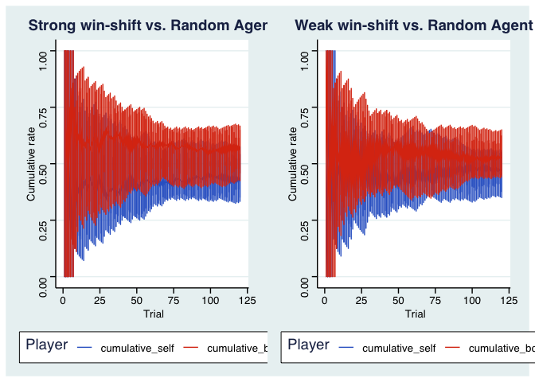
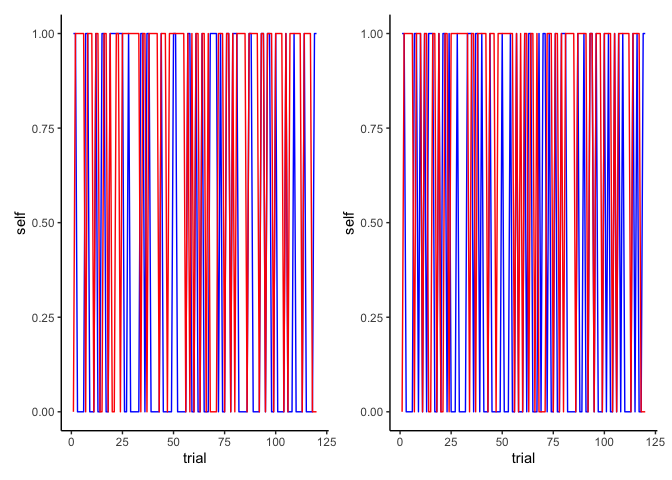

Assignment 1
================
Group 2
2023-02-16

``` r
library(pacman, RcolorBrewer)
library(plyr)
p_load(ggplot2, tidyverse, scales, reshape2, pastecs, ggthemes, patchwork)
```

# FUNCTIONS

## Agent functions

### Random bot - capitalist (coin holder)

``` r
random_agent <- function(bias) {
  choice <- rbinom(1,1, bias)
  return(choice)
}
```

### Win-stay-lose-shift bot - capitalist (coin holder)

``` r
win_stay_agent <- function(prev_choice, feedback) {
  if (feedback == 1){
    choice = prev_choice
  } 
  else if (feedback == 0){
    choice = 1-prev_choice
  }
  return(choice)
}
```

### Competing agent (win-shift)

``` r
#Agent with a strong reaction to loosing, meaning it sticks more to the strategy of staying when losing. 
win_shift_agent <- function(prev_choice, feedback, bias_lose, bias_win) {
  if (feedback == 0) { #lose stay
    if(prev_choice == 0) { 
      choice = rbinom(1, 1, (1-bias_lose))}
    if(prev_choice == 1) { 
      choice = rbinom(1, 1, bias_lose)}
      }
  else if (feedback == 1) { #win shift
    if(prev_choice == 0) { 
      choice = rbinom(1, 1, bias_win)}
    if(prev_choice == 1) { 
      choice = rbinom(1, 1, (1-bias_win))}
  }
  return(choice)  }
```

## Other functions

### Simulation function against random agent

``` r
sim_vs_random <- function(agents, trials, bias_lose, bias_win){
  
  feedback <- array(NA, c(agents, trials))
  performance_df <- data_frame()
  
  for (agent in 1:agents){
    self <- rep(NA, trials)
    bot <- rep(NA, trials)
  
    self[1] <- random_agent(0.5)
    
    for(trial in seq(trials)) {
      bot[trial] <- random_agent(bot_bias)
    }
    
    for (trial in 2:trials){
      if(self[trial-1] == bot[trial-1]) {
        feedback[agent, trial] = 1
      } 
      else {
        feedback[agent, trial] = 0
      }
      self[trial] <- win_shift_agent(prev_choice = self[trial-1], 
                                      feedback = feedback[agent, trial], 
                                      bias_lose = bias_lose, 
                                      bias_win = bias_win)
    }
    
    df_temp <- tibble(agent = agent, self, bot, trial = seq(trials), 
                      feedback = as.numeric(self==bot)) %>% 
      mutate(cumulative_self = cumsum(feedback)/seq_along(feedback),
             cumulative_bot = cumsum(1-feedback)/seq_along(feedback)) 
    
    performance_df <- rbind(performance_df, df_temp)
    
  }
  
  return(performance_df)
}
```

### Simulation function agains win-stay-lose-shift

``` r
sim_vs_wsls <- function(agents, trials, bias_lose, bias_win){
  feedback <- array(NA, c(agents, trials))
  performance_df <- data_frame()
  
  for (agent in 1:agents){
    self <- rep(NA, trials)
    bot <- rep(NA, trials)
    self[1] <- random_agent(0.5)
    bot[1] <- random_agent(0.5)
  
    for (trial in 2:trials){
      if (self[trial-1] == bot[trial-1]){
        feedback[agent, trial] = 1
        } 
      else {
        feedback[agent, trial] = 0
        }
      self[trial] <- win_shift_agent(prev_choice = self[trial-1], 
                                  feedback = feedback[agent, trial], 
                                  bias_lose = bias_lose_strong, 
                                  bias_win = bias_win_strong)
      bot[trial] <- win_stay_agent(prev_choice = bot[trial-1], feedback = 1-feedback[agent,trial])
    }
    
    df_temp <- tibble(agent = agent, self, bot, trial = seq(trials), 
                      feedback = as.numeric(self==bot)) %>% 
      mutate(cumulative_self = cumsum(feedback)/seq_along(feedback),
             cumulative_bot = cumsum(1-feedback)/seq_along(feedback)) 
    
    performance_df <- rbind(performance_df, df_temp)
  }
  
  return(performance_df)
}
```

### Plot prepping

``` r
plot_prep <- function(data){
  #' Takes the cumulative rates for self and bot and calculates the mean for every trial. 
  #' Returns a dataframe in long format
  plot_df <- tibble()

  cumulative_self <- data %>% 
    dplyr::group_by(trial) %>% 
    dplyr::summarise(mean(cumulative_self)) %>% 
    dplyr::rename("Self" = "mean(cumulative_self)")

  cumulative_bot <- data %>% 
   dplyr::group_by(trial) %>% 
    dplyr::summarise(mean(cumulative_bot)) %>% 
    select("mean(cumulative_bot)") %>% 
    dplyr::rename("Bot" = "mean(cumulative_bot)")

  plot_df <- cbind(cumulative_self, cumulative_bot) %>% 
    reshape2::melt(id.var = "trial", variable.name = "Player")
  
  return(plot_df)
}
```

## initiating parameters

``` r
agents <- 100
trials <- 120

#random agent bias
bot_bias <- 0.7

# strong reaction to loosing, meaning it sticks more to the strategy of staying when losing. 
bias_lose_strong <- 0.9
bias_win_strong <- 0.7

# uncertain reaction to loosing, meaning it sticks less to the strategy of staying when losing. 
bias_lose_weak <- 0.7
bias_win_weak <- 0.9
```

# AGENT TOURNAMENT 1: win-shift playng against random bot

## FIRST STRATEGY: playing win-shift-lose-stay with a strong reaction to loss (strong strategy) against the random agent

### Simulation

``` r
set.seed(1993)
performance_df <- sim_vs_random(agents = agents, 
                                trials = trials, 
                                bias_lose = bias_lose_strong, 
                                bias_win = bias_win_strong)
```

    ## Warning: `data_frame()` was deprecated in tibble 1.1.0.
    ## ℹ Please use `tibble()` instead.

### Sanity check

``` r
#Sanity check plot
sanity_check_df <- sim_vs_random(agents = 1, 
                                trials = trials, 
                                bias_lose = bias_lose_strong, 
                                bias_win = bias_win_strong)

sanity_strong_vs_random <-sanity_check_df %>% 
  ggplot() +
  geom_line(color = "blue", aes(trial, self)) +
  geom_line(color = "red", aes(trial, bot)) +
  theme_classic()
```

### Plot the strong win-switch vs random agent

``` r
df_strong_vs_random_mean <- plot_prep(performance_df)

df_strong_vs_random <- performance_df %>% 
  select("agent", "trial", "cumulative_self", "cumulative_bot") %>% 
  reshape2::melt(id.var = c("agent", "trial"), variable.name = "Player")

strong_vs_random_mean <- ggplot(df_strong_vs_random_mean, aes(trial, value)) +
  geom_line(aes(color = Player)) +
  scale_y_continuous(limits = c(0, 1.0)) +
  theme_stata() +
  scale_color_gdocs() +
  labs(title ="Strong win-shift vs. Random Agent", x = " Trial", y = "Mean cumulative rate") +
  theme(plot.title = element_text(face = "bold", size = 14, hjust=0.5))

strong_vs_random <- ggplot(df_strong_vs_random, aes(trial, value)) +
  geom_line(aes(color = Player)) + 
  theme_stata() +
  scale_color_gdocs() +
  labs(title ="Strong win-shift vs. Random Agent", x = " Trial", y = "Cumulative rate") +
  theme(plot.title = element_text(face = "bold", size = 14, hjust=0.5))
```

## SECOND STRATEGY: playing win-switch-lose-stay with uncertain reaction to loss (i.e. a weak adherence to the strategy when losing)

### Simulation

``` r
set.seed(1993)
performance_df <- sim_vs_random(agents = agents, 
                                trials = trials, 
                                bias_lose = bias_lose_weak, 
                                bias_win = bias_win_weak)
```

### Sanity check

``` r
#Sanity check plot
sanity_check_df <- sim_vs_random(agents = 1,
                                trials = trials, 
                                bias_lose = bias_lose_weak, 
                                bias_win = bias_win_weak)

sanity_weak_vs_random <- sanity_check_df %>% ggplot() +
  geom_line(color = "blue", aes(trial, self)) +
  geom_line(color = "red", aes(trial, bot)) +
  theme_classic()
```

### Plot the weak win-switch vs random agent

``` r
df_weak_vs_random_mean <- plot_prep(performance_df)

df_weak_vs_random <- performance_df %>% 
  select("agent", "trial", "cumulative_self", "cumulative_bot") %>% 
  reshape2::melt(id.var = c("agent", "trial"), variable.name = "Player")

weak_vs_random_mean <- ggplot(df_weak_vs_random_mean, aes(trial, value)) +
  geom_line(aes(color = Player)) +
  scale_y_continuous(limits = c(0, 1.0)) +
  theme_stata() +
  scale_color_gdocs() +
  labs(title ="Weak win-shift vs. Random Agent", x = " Trial", y = "Mean cumulative rate") +
  theme(plot.title = element_text(face = "bold", size = 14, hjust=0.5))

weak_vs_random <- ggplot(df_weak_vs_random, aes(trial, value)) +
  geom_line(aes(color = Player)) + 
  theme_stata() +
  scale_color_gdocs() +
  labs(title ="Weak win-shift vs. Random Agent", x = " Trial", y = "Cumulative rate") +
  theme(plot.title = element_text(face = "bold", size = 14, hjust=0.5))
```

# AGENT TOURNAMENT 2: win-switch playing against win-stay

## FIRST STRATEGY: playing win-switch-lose-stay with a strong reaction to loss (strong strategy) against the random agent

``` r
set.seed(1993)
performance_df <- sim_vs_wsls(agents = agents,
                              trials = trials,
                              bias_lose = bias_lose_strong, 
                              bias_win = bias_win_strong)
```

### Sanity check

``` r
#Sanity check plot
sanity_check_df <- sim_vs_wsls(agents = 1,
                                trials = trials, 
                                bias_lose = bias_lose_strong, 
                                bias_win = bias_win_strong)

sanity_strong_vs_wsls <- sanity_check_df %>%
  ggplot() +
  geom_line(color = "blue", aes(trial, self)) +
  geom_line(color = "red", aes(trial, bot)) +
  theme_classic()
```

### Plot the strong wsls

``` r
df_strong_vs_wsls_mean <- plot_prep(performance_df)

df_strong_vs_wsls <- performance_df %>% 
  select("agent", "trial", "cumulative_self", "cumulative_bot") %>% 
  reshape2::melt(id.var = c("agent", "trial"), variable.name = "Player")

strong_vs_wsls_mean<- ggplot(df_strong_vs_wsls_mean, aes(trial, value)) +
  geom_line(aes(color = Player)) +
  scale_y_continuous(limits = c(0, 1.0)) +
  theme_stata() +
  scale_color_gdocs() +
  labs(title ="Strong win-shift vs. win-stay", x = " Trial", y = "Mean cumulative rate") +
  theme(plot.title = element_text(face = "bold", size = 14, hjust=0.5))

strong_vs_wsls <- ggplot(df_strong_vs_wsls, aes(trial, value)) +
  geom_line(aes(color = Player)) + 
  theme_stata() +
  scale_color_gdocs() +
  labs(title ="Strong win-shift vs. win-stay", x = " Trial", y = "Cumulative rate") +
  theme(plot.title = element_text(face = "bold", size = 14, hjust=0.5))
```

## SECOND STRATEGY: playing win-shift-lose-stay with uncertain reaction to loss (i.e. a weak adherence to the strategy when losing)

``` r
set.seed(1993)
performance_df <- sim_vs_wsls(agents = agents,
                              trials = trials,
                              bias_lose = bias_lose_weak, 
                              bias_win = bias_win_weak)
```

### Sanity check

``` r
#Sanity check plot
sanity_check_df <- sim_vs_wsls(agents = 1,
                                trials = trials, 
                                bias_lose = bias_lose_weak, 
                                bias_win = bias_win_weak)

sanity_weak_vs_wsls <- sanity_check_df %>%
  ggplot() +
  geom_line(color = "blue", aes(trial, self)) +
  geom_line(color = "red", aes(trial, bot)) +
  theme_classic()
```

### Plot the weak wsls

``` r
df_weak_vs_wsls_mean <- plot_prep(performance_df)

df_weak_vs_wsls <- performance_df %>% 
  select("agent", "trial", "cumulative_self", "cumulative_bot") %>% 
  reshape2::melt(id.var = c("agent", "trial"), variable.name = "Player")

weak_vs_wsls_mean <- ggplot(df_weak_vs_wsls_mean, aes(trial, value)) +
  geom_line(aes(color = Player)) +
  scale_y_continuous(limits = c(0, 1.0)) +
  theme_stata() +
  scale_color_gdocs() +
  labs(title ="Weak win-shift vs. win-stay", x = " Trial", y = "Mean cumulative rate") +
  theme(plot.title = element_text(face = "bold", size = 14, hjust=0.5))

weak_vs_wsls <- ggplot(df_weak_vs_wsls, aes(trial, value)) +
  geom_line(aes(color = Player)) + 
  theme_stata() +
  scale_color_gdocs() +
  labs(title ="Weak win-shift vs. win-stay", x = " Trial", y = "Cumulative rate") +
  theme(plot.title = element_text(face = "bold", size = 14, hjust=0.5))
```

# PLOT DISPLAY

## Plot all games

``` r
# Grand mean 
# Tournament 1
strong_vs_random_mean + weak_vs_random_mean #+ strong_vs_wsls_mean + weak_vs_wsls_mean
```

<!-- -->

``` r
# Tournament 2
strong_vs_wsls_mean + weak_vs_wsls_mean
```

<!-- -->

``` r
# Full distribution
# Tournament 1
strong_vs_random + weak_vs_random #+ strong_vs_wsls + weak_vs_wsls
```

<!-- -->

``` r
# Tournament 2
strong_vs_wsls + weak_vs_wsls
```

<!-- -->

## Plot all sanity checks

``` r
# Tournament 1
sanity_strong_vs_random + sanity_weak_vs_random
```

<!-- -->

``` r
# Tournament 2
sanity_strong_vs_wsls + sanity_weak_vs_wsls
```

<!-- -->
